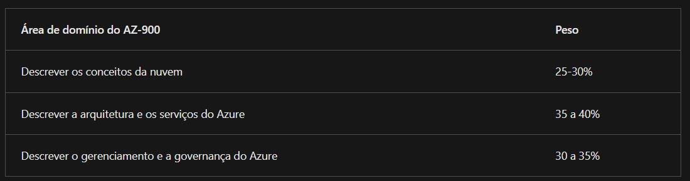
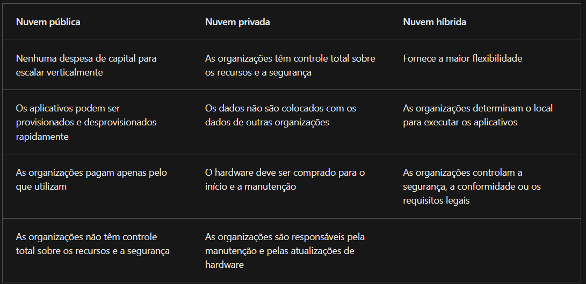
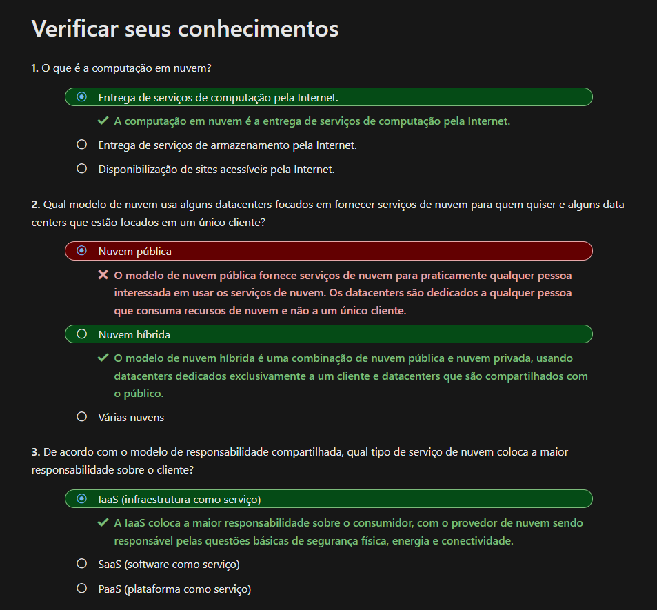
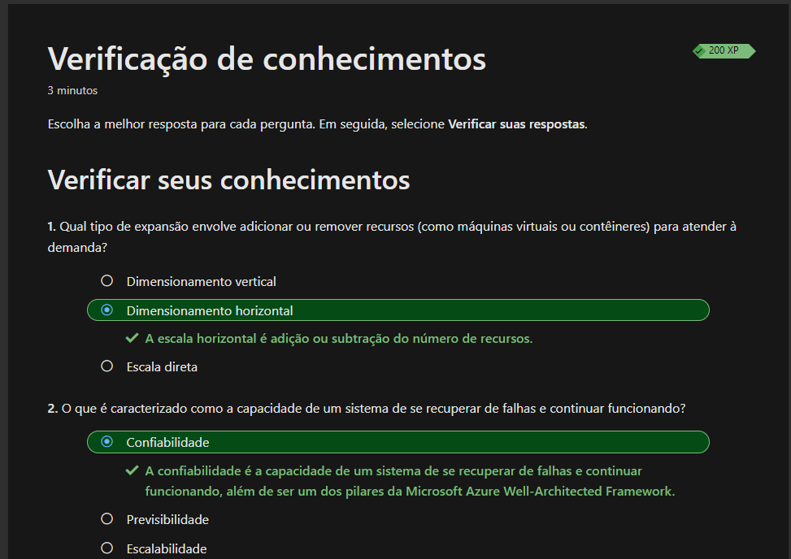
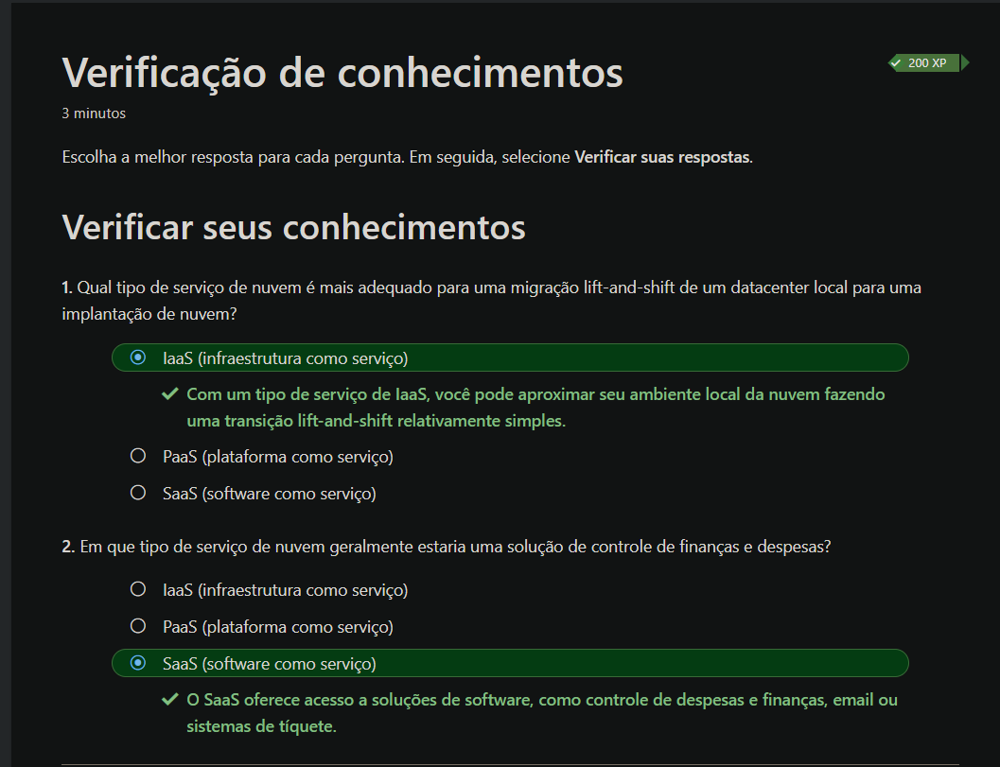
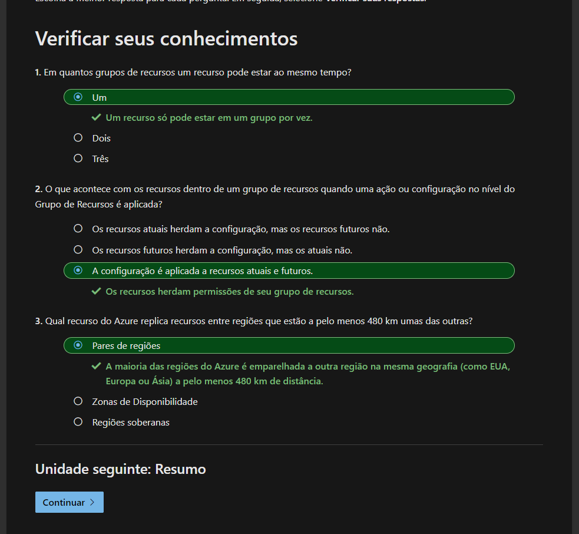

<p align="center">
     
</p>

  <a href="https://learn.microsoft.com/pt-br/certifications/azure-fundamentals/?WT.mc_id=certposter_poster-wwl" target="_blank"> 
    <h1 align="center">
    Estudo Microsoft Certified: Azure Fundamentals
    </h1>
  </a>
  
  <p align="center">
    <a href="https://query.prod.cms.rt.microsoft.com/cms/api/am/binary/RWST4n#page=10" target="_blank"> 
    Trilha DEV
    </a>
&emsp; | &emsp;
    <a href="https://esi.microsoft.com/landing" target="_blank"> 
    Treinamento Microsoft
    </a>
 &emsp;|&emsp;
    <a href="https://query.prod.cms.rt.microsoft.com/cms/api/am/binary/RE2PjDI" target="_blank"> 
    Certificações Microsoft
    </a>
&emsp; | &emsp;
    <a href="https://docs.github.com/pt/get-started/writing-on-github/getting-started-with-writing-and-formatting-on-github/basic-writing-and-formatting-syntax#images" target="_blank"> 
    Documentação git hub
    </a>
</p>

</br>
<a href="https://learn.microsoft.com/pt-br/training/paths/microsoft-azure-fundamentals-describe-cloud-concepts/" target="_blank"> 
    <h1 align="center"> Princípios básicos do Microsoft Azure: descrever os conceitos de nuvem</h1>
</a>

- O Azure também oferece novos recursos, como IA (inteligência artificial) e serviços focados em IoT (Internet das Coisas).

- Esse exame inclui três áreas de domínio de conhecimento
<p align="center">
     
</p>

## Descrever a computação em nuvem

### O que é computação em nuvem?

</br>
A computação em nuvem é a entrega de serviços de computação pela Internet.Os serviços de computação incluem infraestrutura de TI comum, como máquinas virtuais, armazenamento, bancos de dados e rede, IoT (Internet das Coisas), ML (machine learning) e IA (inteligência artificial)

</br>

#### É sempre reponsavel o:

| PROVEDOR          | USUÁRIO                      |
| ----------------- | ---------------------------- |
| Datacenter físico | Dados que coloca no sistema  |
| Rede física       | Dispositivos que se conectam |
| Hosts físicos     | Usuários que têm acesso      |

</br>

#### O que é modelo de responsabilidade compartilhada?

</br>
Segurança física, energia, resfriamento e conectividade de rede são responsabilidade do provedor de nuvem já o consumidor é responsável pelos dados e pelas informações armazenados na nuvem e segurança de acesso

- IaaS (infraestrutura como serviço) o provedor de nuvem é responsável pelas questões básicas de segurança física, energia e conectividade, enquanto o consumidor tem a responsabilidade pela instalação, configuração, aplicação de patch, atualizações e segurança dos recursos de nuvem que aluga. Basicamente, o consumidor aluga o hardware em um datacenter de nuvem e decide como utilizar e gerenciar esses recursos.
  - Cenários comuns em que o IaaS faz sentido:
    - Migração lift-and-shift
    - Teste e desenvolvimento
    - Controle total sobre o SO (sistema operacional).
    - Capacidade para executar um software personalizado.
    - Usar configurações personalizadas de hospedagem.
  - Migração lift-and-shift:
    - Recursos de nuvem semelhantes aos do datacenter local
    - Migração dos elementos em execução local para execução na infraestrutura IaaS
  - Teste e desenvolvimento:
    - Estabelecimento de configurações para ambientes de desenvolvimento e teste
    - Necessidade de replicar rapidamente os ambientes estabelecidos
    - Ativação ou desativação rápida dos diferentes ambientes com uma estrutura de IaaS
    - Manutenção do controle completo sobre os ambientes

Obs: `Conjuntos de Dimensionamento de Máquinas Virtuais` automatizam a criação e gerenciamento de grupos de VMs idênticas com balanceamento de carga quando é utilizado o IaaS.

</br>

- PaaS (plataforma como serviço) está situado entre o IaaS e o SaaS e compartilha a responsabilidade entre o provedor de nuvem e o consumidor. O provedor de nuvem mantém os sistemas operacionais, bancos de dados e ferramentas de desenvolvimento.Dependendo da configuração, o provedor de nuvem ou o consumidor pode ser responsável pelas configurações de rede e conectividade, segurança de rede e aplicativo e infraestrutura de diretório.
  - Cenários comuns em que o PaaS faz sentido:
    - Estrutura de desenvolvimento:
      - O PaaS fornece uma estrutura para desenvolvedores criarem ou personalizarem aplicativos baseados em nuvem.
      - Reduz a quantidade de codificação necessária, pois os desenvolvedores podem usar componentes de software internos.
      - Inclui recursos de nuvem, como escalabilidade, alta disponibilidade e multilocação.
    - Análise ou business intelligence:
      - As ferramentas fornecidas como serviço com o PaaS permitem que as organizações analisem e minerem dados.
      - Encontrando insights e padrões e prevendo resultados para aprimorar previsões, decisões de design de produto, retornos sobre investimentos e outras decisões de negócios.

Obs: "As `Instâncias de Contêiner do Azure` oferecem uma maneira simples e rápida de executar contêineres no Azure sem gerenciar máquinas virtuais"

</br>

- SaaS (software como serviço) maior parte da responsabilidade no provedor de nuvem. Você está essencialmente alugando ou usando um aplicativo totalmente desenvolvido. Ele requer a menor quantidade de conhecimento técnico ou experiência para o emprego total.
  - Cenários comuns em que o SaaS faz sentido:
    - Email e mensagens.
    - Aplicativos de produtividade empresarial.
    - Controle de finanças e despesas.

</br>

#### Modelos de nuvem privado, público e híbrido.

 <p align="center">
     
</p>

</br>

#### Azure Arc

O Azure Arc gerencia o ambiente de nuvem, seja uma nuvem pública exclusivamente no Azure, uma nuvem privada em seu datacenter, uma configuração híbrida ou até mesmo um ambiente de várias nuvens em execução em vários provedores de nuvem ao mesmo tempo.

</br>

#### Solução VMware no Azure

E se você já estiver estabelecido com o VMware em um ambiente de nuvem privada, mas quiser migrar para uma nuvem pública ou híbrida? A Solução VMware no Azure permite executar suas cargas de trabalho do VMware no Azure com integração e escalabilidade total.

</br>

## Modelo baseado em consumo

Existem dois tipos de despesas:CapEx (despesas de capital) e OpEx (despesas operacionais).

- A CapEx normalmente é uma despesa inicial única para comprar ou proteger recursos tangíveis.
- A computação em nuvem se enquadra na OpEx porque opera em um modelo baseado em consumo. Na computação em nuvem, você não paga pela infraestrutura física, pela eletricidade, pela segurança nem por nada que esteja associado à manutenção de um datacenter. Você paga pelos recursos de TI que usa. Se você não usar nenhum recurso de TI durante o mês, não pagará nada.

Um modelo baseado em consumo oferece vários benefícios, como:

- Sem custos prévios.
- Não há necessidade de comprar nem gerenciar uma infraestrutura cara que os usuários talvez não usem na capacidade máxima.
- A capacidade de pagar para obter mais recursos quando necessário.
- A capacidade de parar de pagar por recursos que não são mais necessários.

</br>

## Verificar seus conhecimentos

</br>
<p align="center">
     
</p>
</br>

## Descrever os benefícios do uso de serviços de nuvem

</br>
O tempo de atividade (ou disponibilidade) e a capacidade de lidar com a demanda (ou a escala).

- Alta disponibilidade: se concentra em garantir a disponibilidade máxima, independentemente de interrupções ou eventos que possam ocorrer.
- Escalabilidade: significa que você poderá adicionar mais recursos para lidar melhor com o aumento da demanda.

A escala geralmente vem em duas variedades: vertical e horizontal.

- Dimensionamento vertical: Maior capacidade de processamento adicionar mais CPUs ou RAM
- Dimensionamento horizontal: Replicando a aplicação por exemplo em container ou maquina virtuais.

</br>

## Descrever os benefícios da confiabilidade e da previsibilidade na nuvem

Confiabilidade e previsibilidade são dois benefícios cruciais na nuvem que ajudam você a desenvolver soluções com confiança.

- Confiabilidade:

  - Resiliência é a capacidade que um sistema tem de se recuperar de falhas e continuar funcionando. Ela também é um dos pilares do `Microsoft Azure Well-Architected Framework`.
  - Devido ao design descentralizado, a nuvem naturalmente dá suporte a uma infraestrutura confiável e resiliente. Com um design descentralizado, a nuvem permite que você tenha recursos implantados em várias regiões do mundo.

- Previsibilidade: Obtem a previsibilidade do custo e desempenho. Ao implantar uma solução criada com base nessa estrutura `Microsoft Azure Well-Architected Framework`, você tem uma solução com custo e desempenho previsíveis.

- Desempenho: A previsibilidade de desempenho se concentra em prever os recursos necessários para oferecer uma experiência positiva aos clientes. Exemplo: dimensionamento automático, balanceamento de carga, alta disponibilidade e etc.

- Custo: A previsibilidade de custos se concentra em prever o custo dos gastos com a nuvem. Monitorando os recursos e custo para poder tomar decisões. Você pode até mesmo usar ferramentas como TCO (custo total de propriedade) ou a Calculadora de Preços para obter uma estimativa de possíveis gastos com a nuvem
  </br>

## Descrever os benefícios da segurança e da governança na nuvem

1. Suporte à governança e conformidade:
   - Recursos de nuvem ajudam a garantir que todos os recursos implantados atendam aos padrões corporativos e regulatórios.
   - Modelos de conjunto e auditoria baseada em nuvem sinalizam recursos que estejam fora de conformidade e fornecem estratégias de mitigação.
   - É possível atualizar todos os recursos implantados com novos padrões à medida que os padrões são alterados.
2. Soluções de segurança personalizáveis:
   - Infraestrutura como serviço fornece recursos físicos, mas permite que você gerencie sistemas operacionais e software instalado, incluindo aplicação de patches e manutenção.
   - Plataforma e software como serviço oferecem a opção de tratamento automático de patches e manutenção.
3. Proteção contra ataques DDoS:
   - Os provedores de nuvem são adequados para lidar com situações como ataques de DDoS, tornando a rede mais robusta e segura.
4. Importância da presença de governança na nuvem:
   - Estabelecer uma presença de governança o mais cedo possível ajuda a manter a presença de nuvem atualizada, protegida e bem gerenciada.

</br>

### Tipos de capacidade de gerenciamento para computação

Recursos de gerenciamento da nuvem:

- Escalabilidade automática de recursos com base na necessidade.
- Implantação de recursos com base em modelos pré-configurados, removendo a necessidade de configuração manual.
- Monitoramento da integridade dos recursos e substituição automática de recursos com falha.
  Recebimento de alertas automáticos com base em métricas configuradas para obter desempenho em tempo real.

Opções de gerenciamento na nuvem:

- Gerenciamento por meio de um portal da web.
- Gerenciamento usando uma interface de linha de comando.
- Gerenciamento usando APIs.
- Gerenciamento usando o PowerShell.

## Verificar seus conhecimentos

</br>
<p align="center">
     
</p>
</br>

## Verificar seus conhecimentos

</br>
<p align="center">
     
</p>
</br>

<a href="https://learn.microsoft.com/pt-br/training/paths/azure-fundamentals-describe-azure-architecture-services/" target="_blank"> 
    <h1 align="center"> Conceitos básicos do Azure: descrever a arquitetura e os serviços do Azure</h1>
</a>

## Descrever os principais componentes arquitetônicos do Azure

#### Conta gratuita do Azure

| OPÇÃO                                    | COMUM       | ESTUDANTE                   |
| ---------------------------------------- | ----------- | --------------------------- |
| Acesso a produtos populares por 12 meses | X           | X                           |
| Um crédito                               | 30 dias     | US$ 100 por 12 meses        |
| Acesso ferramentas                       | 25 produtos | Desenvolvedores de software |

</br>

### Microsoft Learn

Microsoft Learn são exercicios que utilizam da `área restrita` como assinatura temporaria.
A `área restrita` pode ser utilizada com a assinatura pessoal, deve ser usado preferencialmente para criar e testar recursos do Azure sem gerar custos.

- A maioria dos comandos específicos do Azure começará com as letras az.
- O modo interativo possibilita preenchimento automático, descrições de comando e até mesmo exemplos.
- Para usar o modo interativo da CLI do Azure:

```
az interactive
```

- O modo interativo é configurado especificamente para o Azure, portanto, você não precisa inserir az para iniciar um comando

</br>

Os principais componentes da arquitetura do Azure podem ser divididos em dois agrupamentos principais: a infraestrutura física e a infraestrutura de gerenciamento.

- Infraestrutura física: são datacenters com, racks com energia, refrigeração e infraestrutura de rede dedicadas.São agrupados em Regiões do Azure ou em Zonas de Disponibilidade para obter resiliência e confiabilidade.
  - Regiões do Azure: Uma região é uma área geográfica do planeta que contém pelo menos um data center ou vários conectado a uma rede de baixa latência. Usa controle inteligente de recursos para balancear cargas de trabalho nas regiões.

</br>

### As zonas de disponibilidade

As zonas de disponibilidade: são datacenters separados fisicamente, equipados com energia, resfriamento e rede independentes. Se uma zona ficar inativa, as outras continuarão funcionando. As zonas são conectadas por redes privadas de alta velocidade.

- Tenha em mente que pode haver um custo para duplicar seus serviços e transferir dados entre zonas de disponibilidade.
- São destinadas principalmente para:
  - VMs, discos gerenciados, balanceadores de carga e bancos de dados SQL
  - Enquadram-se em três categorias:
    - Serviços em zonas: você fixa o recurso a uma zona específica (por exemplo, VMs, discos gerenciados, endereços IP).
    - Serviços com redundância de zona: a plataforma replica automaticamente entre zonas (por exemplo, armazenamento com redundância de zona, Banco de Dados SQL).
    - Serviços não regionais: os serviços estão sempre disponíveis em geografias do Azure e são resilientes a interrupções em toda a zona, bem como a interrupções em toda a região.

### Pares de regiões

- A maioria das regiões do Azure é emparelhada com outra região na mesma geografia, com pelo menos 300 milhas (480 km) de distância, permitindo a replicação de recursos em uma geografia.
- Essa abordagem ajuda a reduzir a probabilidade de interrupções devido a eventos como desastres naturais, conflitos civis, quedas de energia ou interrupções de rede física afetarem toda uma região.
- Se uma região em um par de regiões for afetada por um desastre natural, os serviços farão failover automaticamente para a outra região nesse par.

### Vantagens adicionais pares de regiões

- Em caso de interrupção do Azure, uma região de cada par é priorizada para restauração rápida dos aplicativos.
- As atualizações são distribuídas para regiões emparelhadas uma por vez, minimizando o tempo de inatividade.
- Os dados permanecem na mesma geografia que seu par, exceto no Sul do Brasil.

### Regiões soberanas

Regiões soberanas são instâncias do Azure isoladas da instância principal do Azure. Talvez seja necessário usar uma região soberana para fins legais ou de conformidade.

</br>

## [Descrever a infraestrutura de gerenciamento do Azure]("https://learn.microsoft.com/pt-br/training/modules/describe-core-architectural-components-of-azure/6-describe-azure-management-infrastructure")

Recurso é qualquer coisa que você criar, provisionar, implantar etc. Exe:VMs, redes virtuais, bancos de dados, serviços cognitivos etc.

Grupos de recursos são agrupamentos de recursos no Azure. Ações aplicadas em um grupo afetam todos os recursos. Não há regras rígidas para uso.

Grupos de recursos:

- É um agrupamento de recursos.
- Permite aplicar ações a todos os recursos de forma conveniente.
- Recursos não podem ser aninhados dentro de grupos de recursos.
- Não há regras rígidas para usar grupos de recursos.
- As regras são aplicadas ao grupo e não a recursos.

## Assinaturas do Azure

Uma assinatura do Azure é uma identidade no Azure AD (Azure Active Directory).
Em uma conta com várias assinaturas, pode-se configurar diferentes modelos de cobrança e aplicar diferentes políticas de gerenciamento de acesso e definir limites em relação a produtos, serviços e recursos do Azure.
Você pode usar dois tipos de limites de assinatura:

- Limite de cobrança: Esse tipo de assinatura determina como uma conta do Azure é cobrada pelo uso do Azure. Você pode criar várias assinaturas para atender a diferentes tipos de requisitos de cobrança. O Azure gera relatórios de cobrança e faturas separados para cada assinatura, para que você possa organizar e gerenciar os custos.

- Limite de controle de acesso: O Azure aplica políticas de gerenciamento de acesso no nível da assinatura, e você pode criar assinaturas separadas para refletir diferentes estruturas organizacionais. Um exemplo disso é que, em um negócio, você tem diferentes departamentos aos quais aplica políticas de assinatura do Azure distintas. Esse modelo de cobrança permite gerenciar e controlar o acesso aos recursos que os usuários provisionam com assinaturas específicas.

É possivel criar assinaturas adicionais para separar: Ambientes, estruturas organizacionais e cobrança.

## Grupos de gerenciamento do Azure (Grupo de Assinaturas)

O uso de grupos de gerenciamento no Azure organiza assinaturas e recursos de forma eficiente, especialmente em casos com muitos aplicativos e equipes. Os grupos fornecem um nível de escopo acima das assinaturas e permitem aplicar condições de governança a várias assinaturas. Os grupos de gerenciamento podem ser aninhados, e todas as assinaturas em um grupo herdam as condições aplicadas a ele.

- 10.000 grupos de gerenciamento podem ter suporte em um único diretório.
- Uma árvore do grupo de gerenciamento pode dar suporte a até seis níveis de profundidade. Esse limite não inclui o nível raiz nem o nível da assinatura.
- Cada grupo de gerenciamento e assinatura podem dar suporte a somente um pai.

## Verificar seus conhecimentos

</br>
<p align="center">
     
</p>
</br>

## [Descrever os serviços de computação e rede do Azure]("https://learn.microsoft.com/pt-br/training/modules/describe-azure-compute-networking-services/")

### Conjuntos de disponibilidade da máquina virtual

Conjuntos de disponibilidade de máquinas virtuais garantem que as VMs tenham conectividade de rede e energia variadas para impedir que todas as VMs caiam em uma falha. Eles agrupam VMs em domínios de atualização e falha, permitindo que você aplique atualizações sabendo que apenas um agrupamento estará offline por vez. Por padrão, um conjunto de disponibilidade dividirá suas VMs em até três domínios de falha para proteção contra falhas de energia física ou de rede.

- Não há custo adicional para configurar um conjunto de disponibilidade, apenas pelas instâncias de VM criadas.

### Exemplos de quando usar VMs

As VMs são úteis em várias situações, como testes e desenvolvimento, execução de aplicativos na nuvem, extensão do datacenter para a nuvem e recuperação de desastres. Elas permitem que você crie diferentes configurações de sistema operacional e aplicativos rapidamente e pode economizar recursos, desligando VMs quando não são necessárias e iniciando-as rapidamente quando a demanda aumenta. Em caso de falha do datacenter primário, você pode criar VMs em execução no Azure para executar seus aplicativos críticos e desligá-los quando o datacenter primário estiver operacional novamente.

### Descrever a Área de Trabalho Virtual do Azure

Azure Virtual Desktop é um serviço de virtualização de desktop e aplicativos na nuvem, permitindo acesso remoto a sistemas Windows e aplicativos. Os aplicativos ficam separados do hardware local, executa aplicativos e dados na nuvem, reduzindo o risco de deixar informações confidenciais em dispositivos pessoais. As sessões de usuário são isoladas em ambientes de sessão única ou multissessão do Windows 10 ou Windows 11 Enterprise.

### Azure Functions

Azure Functions é uma opção de computação sem servidor controlada por eventos, sem necessidade de manutenção de VMs ou contêineres em execução constante, só é cobradp pelo tempo de CPU usado durante a execução. Podem ser sem estado ou com estado (Durable Functions) e são um componente chave da computação sem servidor, permitindo flexibilidade para gerenciar o dimensionamento, executar em redes virtuais e isolar completamente as funções.

- funções com estado (`Durable Functions`) do Azure são uma ferramenta poderosa para criar fluxos de trabalho de longa duração e com estado,, onde cada etapa pode ser uma função separada simplificando o gerenciamento de estado, e a coordenação de tarefas assíncronas em aplicativos.

- funções sem estado são reiniciam sempre que são acionadas.

## [Descrever as opções de hospedagem de aplicativo]("https://learn.microsoft.com/pt-br/training/modules/describe-azure-compute-networking-services/7-describe-application-hosting-options")

VM (máquina virtual) ou contêineres e pode utilizar `O Serviço de Aplicativo do Azure` permite que você se concentre em criar e manter seu aplicativo, e o Azure se concentra em manter o ambiente em funcionamento oferecemdo dimensionamento automático e alta disponibilidade.

### Tipos de serviços de aplicativos

Serviço de Aplicativo a escolha ideal para hospedar aplicativos voltados para a Web.

Pode hospedar:

- Aplicativos Web
- Aplicativos de API
- WebJobs
- Aplicativos móveis

O Serviço de Aplicativo cuida da maioria das decisões de infraestrutura:

- A implantação e o gerenciamento são integrados à plataforma.
- Pontos de extremidade podem ser protegidos.
- Sites podem ser dimensionados rapidamente para lidar com cargas de alto tráfego.
- O balanceamento de carga interno e o gerenciador de tráfego fornecem alta disponibilidade.

### Aplicativos de API

Aplicativos de API permitem criar APIs Web baseadas em REST usando a linguagem e a estrutura que você desejar.

- Suporte completo ao Swagger e a capacidade de empacotar e publicar sua API no Azure Marketplace.
- Os aplicativos de API podem ser consumidos por qualquer cliente baseado em HTTP ou HTTPS.

### Aplicativos de API

O WebJobs geralmente é usado para executar um script, para executar tarefas em segundo plano como parte da lógica do aplicativo.

### Aplicativos móveis

Use o recurso Aplicativos Móveis do Serviço de Aplicativo para criar rapidamente um back-end para aplicativos iOS e Android. Com apenas algumas ações no portal do Azure, você pode:

- Armazenar dados de aplicativo móvel em um Banco de Dados SQL baseado em nuvem.
- Autenticar os clientes em relação a provedores sociais comuns, como MSA, Google, Twitter e Facebook.
- Enviar notificações por push.
- Executar a lógica personalizada de back-end no C# ou Node.js.

No lado do aplicativo móvel, há suporte do SDK para aplicativos nativos para iOS, Android, Xamarin e React.

## [Descrever a Rede Virtual do Azure]("https://learn.microsoft.com/pt-br/training/modules/describe-azure-compute-networking-services/8-virtual-network")

As redes virtuais e sub-redes virtuais permitem que recursos, como VMs, aplicativos Web e bancos de dados, comuniquem-se uns com os outros, com usuários na Internet e com computadores cliente locais. Você pode pensar em uma rede como uma extensão de sua rede local com recursos que vinculam outros recursos.

As redes virtuais do Azure

- Oferecem as seguintes funcionalidades de rede essenciais:
  - Isolamento e segmentação
  - Comunicação pela Internet
  - Comunicação entre recursos do Azure
  - Comunicação com os recursos locais
  - Rotear tráfego de rede
  - Filtrar tráfego de rede
  - Conectar redes virtuais
- Habilitar a comunicação
  - Pontos de extremidade públicos: têm um endereço IP público.
  - Pontos de extremidade privados: são endereços IP privados dentro de uma rede virtual.

### Isolamento e segmentação

A rede virtual do Azure permite criar várias redes virtuais isoladas. Quando você configura uma rede virtual, define um espaço de endereço IP privado usando intervalos de endereços IP públicos ou privados. O intervalo de IP existe somente na rede virtual e não é roteável pela Internet. Você pode dividir esse espaço de endereços IP em sub-redes e alocar parte do espaço de endereço definido para cada sub-rede nomeada.

Para a resolução de nomes, é possível usar o serviço de resolução de nomes interno do Azure. Você também pode configurar a rede virtual para usar um servidor DNS interno ou externo.
